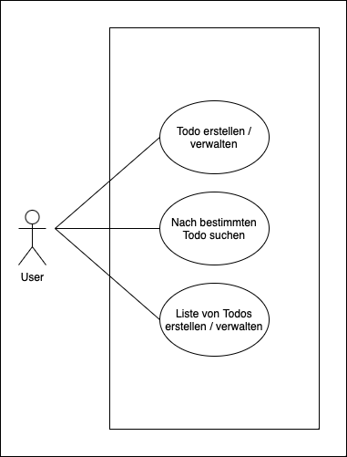
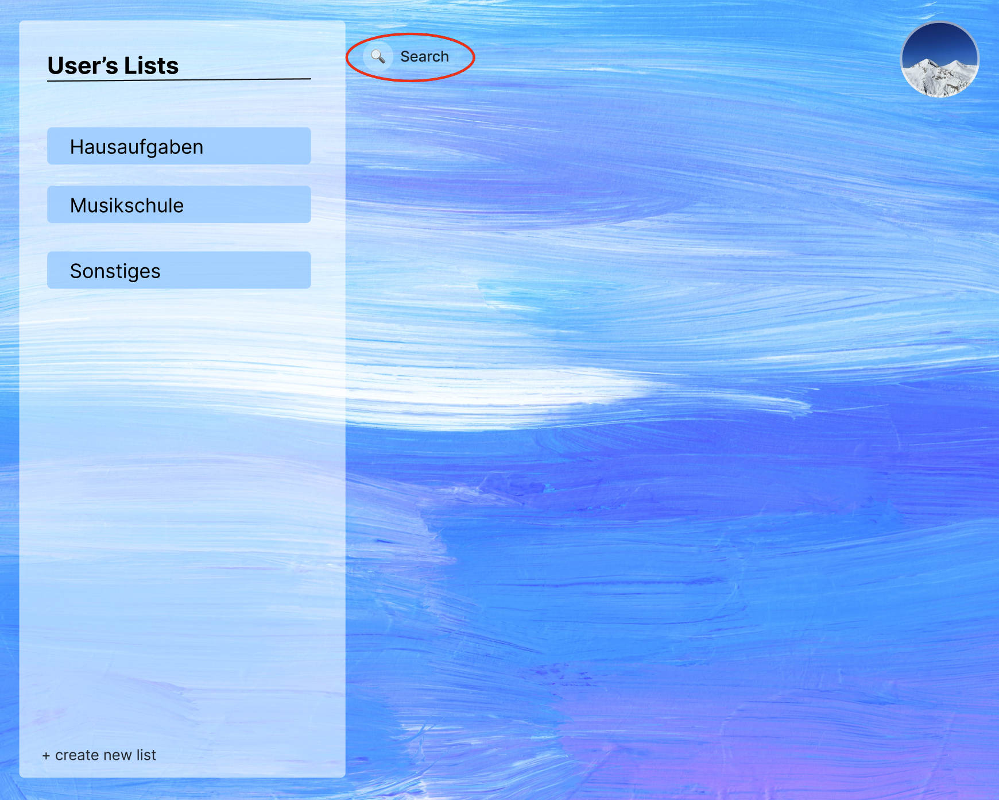
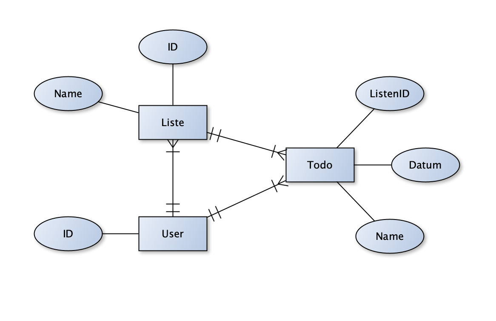

# 1. Ausgangslage und Zielsetzung

## 1.1  Ist-Situation 
In meinem schulischen Alltag habe ich viele Aufgaben zu erledigen. Um die Abgabefristen der verschiedenen Aufgaben nicht zu übersehen und meinen Zeitplan besser managen zu können bin ich auf die Idee gekommen, eine eigene Todo-Liste mit verschiedensten Funnktionen zu programmieren. 

## 1.2 Zielsetzung
Das Ziel ist es, eine funktionierende Todo-Liste zu programmieren, die die Todos in verschiedene Listen gruppieren kann und in welcher die Todos einfach zu erstellen und zu managen sind. 

# 2. Funktionale Anforderungen 

## 2.1 Use-Case Überblick 

## 2.2 Todo erstellen / verwalten 
Dem User ist es möglich, über einen Button ein neues Todo zu erstellen.  
Dies sieht folgendermaßen aus:

Durch den Button gelangt der User in folgendes Menü, über welches ermöglicht wird, den gewünschten Namen und auf Wunsch eine Deadline festzulegen:

Die bestehenden Todos können mithilfe des weißen Buttons auf "finished" gesetzt werden:

Will der User die Liste nach dem Erstellen nochmal überarbeiten oder löschen, muss mit der rechten Maustaste auf das gewünschte Todo geklickt werden.  
Das Menü hierzeu sieht folgendermaßen aus: 

## 2.3 Nach bestimmten Todo suchen
Über eine Suchleiste kann der User anhand des Namens nach bestimmten Todos suchen.  
Der Button hierfür sieht folgendermaßen aus:

Wird dieser gedrückt erscheint folgendes Menü, in welchem die passenden Todos aufgelistet werden: 

## 2.4 Liste von Todos erstellen / verwalten 
Der User kann über ein einen Button neue Listen erstellen (z.B. eine Hü-Liste, in der alle zu erledigenden Aufgaben, durch selbstständige Eingabe aufgelistet sind).  
Siehe rot eingekreist:

Das nächste Bild zeigt das Menü, in dem man eine neue Liste erstellen kann. Um eine Liste zu erstellen, muss zuerst der gewünschte Name eingegeben und dann auf den weißen Button geklickt werden.  
Siehe Bild unten: 

Wenn die Liste im Nachhinein nochmal verändert oder gelöscht werden soll, drückt man auf der gewollten Liste Rechtsklick.  
Das Menü hierzu sieht folgendermaßen aus: 

# 3. Systemarchitektur

## 3.1 Datenmodell 

